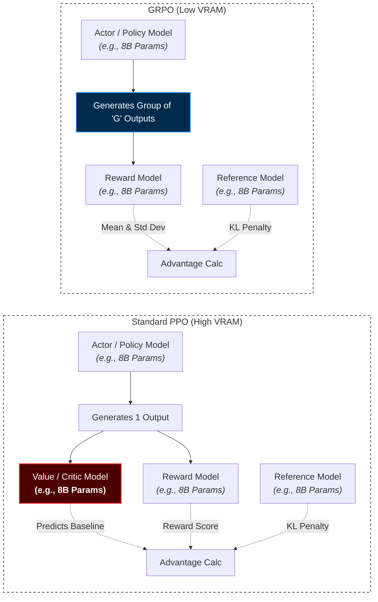
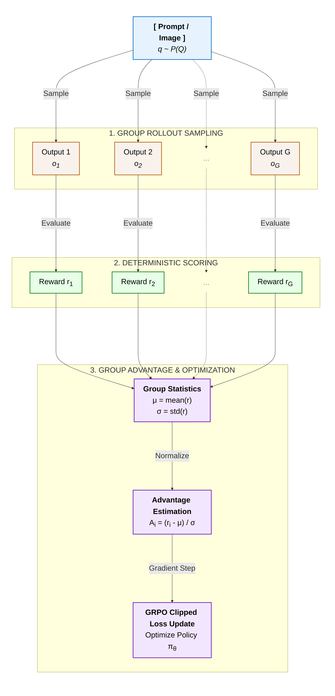

 # <p align="center" style="font-family: Merriweather; font-size: 35px">Curing spatial blindness in VLMs</font></p>

---
> Ask a state-of-the-art Vision-Language Model to write a poem about a sunset, and it will give you a masterpiece. Ask that same model if a robotic gripper is correctly aligned 2 millimeters to the left of a surgical suture, and it will confidently hallucinate a failure. 
---
## List of Contents
* ### [Introduction](#-1-introduction-1-2)
    * ### [What is ViReL?](#what-is-virel)
    * ### [Overview](#overview-1)
* ### [Problem setting](#-2-problem-setting-1)
    * ### [Core issues](#the-core-spatial-problems-we-need-to-fix)
* ### [3. What have we worked on?](#3-what-have-we-worked-on-1)
    * ### [3.1 SFT on VLMs (Flower Classification)](#31-proof-of-concept-1--sft-on-vlms-flower-classification-12)
        * ### [Charts](#charts)
        * ### [Inference](#inference-1)
    * ### [3.2 GRPO on an SLM for GSM8K (Grade school maths)](#32-proof-of-concept-2--grpo-on-an-slm-for-gsm8k)
        * ### [GRPO vs PPO](#why-grpo-over-ppo)
        * ### [Mathematical burden of PPO](#mathematical-burden-of-ppo)
        * ### [What is GRPO?](#what-is-on-policy-grpo)


<br>

---

# <font style="font-family:Merriweather"> 1. Introduction [[1](#what-is-virel)] [[2](#overview-1)]</font>
---
<p style="font-size:18px">
Vision-language models (VLMs) have rapidly mastered semantic understanding, yet they continue to suffer from a critical limitation: spatial blindness.While modern VLMs can fluently describe the contents of a scene, they frequently hallucinate when asked to determine the physical relationship between objects—a fundamental roadblock for embodied AI, autonomous driving, and robotic manipulation. To solve this issue and bridge the gap we introduce ViReL(Vision Reinforced Learning)
</p>

## <font style="font-family:Merriweather">What is ViReL?</font>
<p style="font-size:16px">
ViReL (Vision Reinforcement Learning) is our attempt to build a VLM that grounds its reasoning in what it actually sees, using reinforcement learning rather than supervised fine-tuning alone.
Through this project we target to actually work on curing the spatial blindless of current Vision Language Models by finetuning them on different Reinforcement learning Policies -- Our targeted Policies being GRPO (Group Relative Policy Optimization) and GSPO (Group Sequence Policy Optimization) -- to strictly enforce grounded spatial reasoning with a possible integration of spatial Vision Transformer or ViT backbone. 


*From semantic baseline to spatial reasoning: The full ViReL training architecture.*

### <p style="font-size:20px">Overview</p> 

> <p style="font-size:16px">This blog explores the mechanics behind VLM spatial disconnects, details the training recipes and architectural bets designed to fix them, and unpacks the real-world failure modes encouraged along the way.
---
# <font style="font-family:Merriweather"> 2. Problem Setting [[1](#the-core-spatial-problems-we-need-to-fix)]</font>
<font style="font-size:16px">
Ask a modern vision-language model, "Which object is closer to the camera?" or "Is the mug to the left of the laptop?" and it will answer fluently, confidently, and often wrong. This isn't a knowledge gap—the model has seen millions of images with spatial descriptions in its pretraining corpus. It is a grounding gap: the model has learned to produce the shape of a spatial answer without performing the underlying visual computation that would make the answer reliable.

While training our own VLM-GRPO runs on robot-manipulation VQA data, we caught this failure mode red-handed in the raw completions. Given a prompt asking which of several colored points was closest to the camera, the model's chain-of-thought wasn't reasoning over pixels at all. Instead, it was reasoning over its own uncertainty about whether it even had access to the image:

> "Wait, the user provided an image link, but since I can't view it, maybe I need to think about typical robot vision tasks... Wait, no, maybe the image is described in the context... perhaps this is a hypothetical scenario..."


Or, in other cases, it would completely hallucinate based on global context rather than physical reality:

> "If the screw lies next to the cup it should move to the right, wait no theres another cup to the left of the screw guessing the distance, right cup is closer so i will move to the right"


### The core spatial problems we need to fix
* **Hallucinated Grounding**: The model generates fluent spatial reasoning without verifying whether its claims match the physical coordinate space of the image.

* **Sensitivity to Perspective and Resolution**: Moving a camera slightly or changing the input aspect ratio drastically degrades spatial answers, even when the scene itself hasn't changed.

* **Reward Mismatch**: Standard cross-entropy loss only asks, "Did you predict the next word in the dataset?" What spatial reasoning actually requires is, "Is the final physical relationship true in the physical world?"

Our project, ViReL, is built to cure this exact spatial blindness. By systematically reducing these language-driven hallucinations, we are forcing the model to anchor its reasoning to the actual physical coordinate space—converting raw visual input into reliable, grounded, and actionable spatial data.

---
# <font style="font-family:Merriweather"> 3. What have we worked on? </font>

<font style="font-size:16px">
Before jumping on the actual finetuning of VLMs on the said policies we actually finetuned VLMs on Supervised Finetuning for a very simple task of flower detection and Read about GRPO thoroughly through Deepseek research papers with their applied pipelines for their base model (Deepseek-V3-base). To actually implement and understand GRPO we finetuned an Small language model(SLM) on GRPO for grade school maths (Dataset: OpenAI-gsm8k)
</font>

## <font style="font-family:Merriweather"> 3.1 Proof of Concept 1- SFT on VLMs (Flower Classification) [[1](#training-and-evaluation-metrics)][[2](#inference)]</font>

Before touching spatial reasoning, we validated the supervised fine-tuning (SFT) pipeline itself on a controlled, simple task: fine-tuning SmolVLM2 to classify flower species and emit structured JSON (```{"flower_type": "common dandelion", "confidence": 1.0}```). We ran this test comparing two input resolutions (**res384** vs **res768**).

The initial training metrics looked excellent. Mean token accuracy on the evaluation set converged to ${\sim0.99}$, and eval loss dropped to $\sim0.05$ within roughly **1,000 steps** for the higher-resolution run. However, a corrected, held-out test split told a completely different story: actual task accuracy landed at just $42.45\%\, (433/1020)$.

This contrast gave a critical lesson: token-level SFT is a poor alternative for task-level correctness. The model easily memorized the JSON format and vocabulary, but failed once the evaluation protocol shifted slightly from the training distribution. It is the exact same class of failure—“the model looks confident but isn't grounded”—that motivated our pivot to RL objectives that score the actual output rather than next-token likelihood.

This task helped us learn how to read and analyze metric charts
### Training and Evaluation metrics
 

*Evaluation metrics(v1 and v2)*

 

*Training metrics(v1 and v2)*

As we can see in the charts the model's loss was nearly 0 at very early steps, but this the was the best attempt of training the model with a very small dataset

### Inference


*Example Inference*


*Evaluation Results*

## <font style="font-family:Merriweather">3.2 Proof of concept 2 — GRPO on an SLM for GSM8K</font>

We ran Group Relative Policy Optimization (GRPO) — the algorithm introduced in DeepSeekMath — on a small language model against GSM8K, using Unsloth + TRL's GRPOTrainer to get a better understanding of GRPO as well as the rewards system

## Why GRPO over PPO?

Standard PPO is the base of Reinforcement Learning from Human Feedback (RLHF), but it is incredibly memory-hungry. To train a model using PPO, you typically have to load four separate models into memory simultaneously:

* **The Actor Model** (the one you are training)

* **The Reference Model** (to prevent the actor from deviating too far)

* **The Reward Model** (to score the outputs)

* **The Value Model / Critic** (to estimate the baseline advantage)

The Value Model is usually the exact same size as the Actor model. This means PPO essentially doubles the memory requirements just to calculate the baseline for its reward function.

## The Mathematical Burden of PPO

In standard Proximal Policy Optimization (PPO), the algorithm optimizes the policy by calculating how much better an action was compared to a baseline. To get this baseline, PPO relies on a separate, heavily parameterized Value Network (Critic), denoted as $V_\phi(s_t)$.

The Advantage function $A_t$ basically references this critic model:

$\hat{A_t} = R_t - V_\phi(s_t)$ 

The PPO algorithm has to constantly update two objective Functions

First the **actor objective**:

$L^{CLIP}(\theta)=\mathbb{\hat{E}}\left[\min\ (\dfrac{\pi_\theta(a_t|s_t)}{\pi_{old}(a_t|s_t)}\hat{A_t}, \operatorname{clip}\ (r_t(\theta),1-\epsilon,1+\epsilon)\hat{A_t}\right]$

Here we clip objective term $r_t(\theta)\hat{A_t}$ to prevent over rewarding or underrewarding 

Second the **critic objective** (training the value network to predict better baselines for every iteration):

$L^{VF}(\phi)=\mathbb{\hat{E}}\left[(V_\phi-R_t)^2\right]$

Effective the overall objective is calculated by combining the clip objective term, the critic objective term and entropy bonus:

$L^{CLIP+VF+S} = \mathbb{\hat{E}}\left[L^{CLIP}-c_1L^{VF}+c_2S[\pi_\theta](s_t)\right]$

Because $\pi_\theta$ (the Actor VLM) and $V_\phi$ (the Critic VLM) are often identical in architecture and size, optimizing $L^{VF}(\phi)$ effectively doubles your GPU memory requirements.
Continuous updates of the overall objective function takes up a lot of GPU memory. You are actively training a second Massive Language Model just to guess the baseline advantage.


## What is ON-POLICY GRPO?
Introduced by DeepSeek in the **DeepSeekMath** paper — where they explained their pipeline for their base model(Deepseek-V3-base) — Group Relative Policy Optimization (GRPO) eliminates the learned Critic network ($V_\phi$) entirely. Instead of relying on a multi-billion-parameter neural network to approximate baseline state values, GRPO turns reinforcement learning into a comparative statistical exercise across a group of sampled responses.



Let us see how GRPO works

### &#9733; The 5-Step Execution Loop

### 1. Group rollout sampling

For a given question or visual prompt $q \sim P(Q)$, the current policy $\pi_{\theta_{\text{old}}}$ generates a group of $G$ distinct candidate outputs.
Depending on the compute available we can choose the number of these rollouts:

$\mathcal{O} = \{o_1, o_2, \dots, o_G\}$

Sampling multiple rollouts allows the policy for more **exploration**, Some might hallucinate while others give out the correct answers.

### 2. Reward Evaluation ($r_i$)

Each candidate output $o_i$ is evaluated against a suite of reward functions to compute a scalar reward $r_i$:

$r_i = r_{correctness}(o_i)+r_{format}(o_i)+...$

### 3. Group relative Advantage estimation

Instead of computing temporal-difference errors with a Critic network, GRPO normalizes each response's reward relative to its peers within the sampled group:

$\hat{A_i}=\dfrac{r_i-\operatorname{mean}(r_i)}{\operatorname{std(r_i)\,+\,\epsilon}}$

Here we add small epsilon alongside standard deviation to prevent $DivisionByZero$ error.

**Positive Advantage** ($\hat{A}_i > 0$): The completion performed better than the group average; its token probabilities are boosted.

**Negative Advantage** ($\hat{A}_i < 0$): The completion performed worse than the group average; its token probabilities are penalized.


*Raw Rewards vs Advantages*

### 4. Clipped Surrogate Policy update

GRPO retains PPO's clipped surrogate objective to prevent destructively large policy updates. For each token sequence, the probability ratio is defined as:

$\rho_i(\theta)=\dfrac{\pi_{\theta}(o_i|q)}{\pi_{\theta_{old}}(o_i|q)}$

The surrogate objective clips this ratio within a trust region $[1-\epsilon, 1+\epsilon]$:

$\mathcal{L}^{CLIP}(\theta)=\dfrac{1}{G}\displaystyle \sum_{i=1}^{G}\min(\,\rho_i(\theta)\hat{A_i},\,\operatorname{clip}(\rho_i(\theta),1-\epsilon,1+\epsilon)\hat{A_i})$

### Why we clip?

Imagine your model initially has a 10% chance of correctly answering "8x4". It happens to guess "32" and receives a massive reward. The optimizer now runs multiple passes to increase this probability, bounded by a $\epsilon = 1.2$ clip limit (allowing a max 20% change per step).

Pass 1 (Safe): The optimizer nudges the probability to 11.5%. The ratio (1.15) is under the 1.2 limit. The update is successfully applied.

Pass 2 (Blocked): The optimizer gets greedy and tries to aggressively spike the probability to 20%. The ratio (2.0) violently breaks the 1.2 ceiling. The formula clips it, zeroing out the gradient and blocking the update.

Why it matters: If clipping didn't stop Pass 2, the optimizer would overwrite millions of weights to force that probability to 99% in a single step. The model would memorize 8x4, but the resulting output would cause forgetting, it might literally forget how to speak English. Clipping acts as a leash for stable learning.

### 5. KL-Divergence Penalty

To ensure the policy does not drift too far from the reference model $\pi_{\text{ref}}$ (which leads to reward hacking or linguistic collapse), GRPO adds an explicit KL divergence penalty directly to the objective. If the model explores more the KL spikes up suggesting that the model is completely different model, this may or may not suggest that the model is actually reward hacking or not. If the rewards constantly grows with a stable KL divergence we for sure know the model is learning rather than reward hacking:

$\mathbb{D}_{KL}(\pi_{\theta}\,||\,\pi_{ref})=\dfrac{\pi_{ref}(o_i|q)}{\pi_{\theta}(o_i|q)}-\log\left(\dfrac{\pi_{ref}(o_i|q)}{\pi_{\theta}(o_i|q)}\right)-1$


*KL Divergence Visual*

### The Full GRPO Objective Function
Combining the group surrogate loss and the reference penalty yields the final optimization objective:$$\mathcal{J}_{\text{GRPO}}(\theta) = \mathbb{E}_{q \sim P(Q), \{o_i\}_{i=1}^G \sim \pi_{\theta_{\text{old}}}} \left[ \frac{1}{G} \sum_{i=1}^G \left( \min \left( \rho_i(\theta) \hat{A}_i, \operatorname{clip}(\rho_i(\theta), 1-\epsilon, 1+\epsilon) \hat{A}_i \right) - \beta \mathbb{D}_{KL}(\pi_\theta \parallel \pi_{\text{ref}}) \right) \right]$$

Where:
* $G$ is the group size (typically 4 to 16 **depends upon compute*).
* $\epsilon$ is the clipping threshold (typically 0.1 or 0.2).
* $\beta$ is the KL-Divergence coefficient controlling model drift.